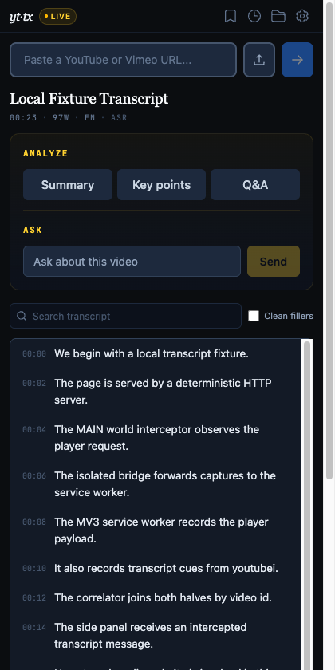

# yt-transcript

Chrome side-panel extension (Manifest V3) for extracting, viewing, and
exporting YouTube and Vimeo transcripts. Optional local Whisper transcription
for videos without captions, and Chrome built-in AI for summaries. No backend,
no accounts, no telemetry.




## Features

**Extraction**

- On YouTube watch pages, a MAIN-world content script intercepts the
  transcript and player responses the page itself fetches, so the side panel
  populates automatically. This also works for videos whose caption requests
  require session-bound tokens.
- Pasted URLs are fetched via YouTube's Innertube API. If YouTube blocks
  that, the extension briefly opens the watch page in a background tab,
  captures the transcript, and closes the tab.
- Vimeo transcripts come from the page's player config (WebVTT track).
- Local Whisper transcription for videos with no captions at all: tab audio
  runs through `whisper-tiny.en` or `whisper-base.en` in-browser via
  transformers.js, using WebGPU when available and WASM otherwise. Model
  weights download from Hugging Face only after an explicit opt-in
  permission prompt.

**Viewing**

- Search, chapter dividers parsed from the video description, speaker-label
  detection, and a filler-word removal toggle.
- Per-segment highlights and notes, persisted in IndexedDB.
- Click any timestamp, in the transcript or in AI output, to seek the video
  player.

**Export**

- Download as TXT, SRT, VTT, JSON, CSV, or Markdown.
- Copy as plain text, Notion-flavored Markdown, Obsidian-flavored Markdown
  (with front matter), or highlights only.
- Batch results export as a ZIP of individual files or one merged file.

**Batch (YouTube only)**

- Paste a playlist or channel URL, or upload a `.csv`/`.txt` of video URLs,
  then pick which videos to fetch.
- Transcripts are fetched four at a time, with retry for failed items.

**AI (on-device)**

- Summary, key points, Q&A, and a chat box grounded in the transcript, all
  running on Chrome built-in AI (Gemini Nano) where the browser provides it.
  Input is measured and trimmed to fit the on-device model's quota.
- No API keys, no provider accounts, no cloud AI calls. The Settings panel
  shows whether built-in AI is available in your Chrome.

**Other**

- Recent-history and saved-transcripts modals, with tags.
- Everything is stored locally (`chrome.storage` and IndexedDB).

## Install

**Chrome Web Store**: [YouTube & Vimeo Transcript Extractor](https://chromewebstore.google.com/detail/youtube-vimeo-transcript/ahddbfbjafmbceehebpeanpnlbaimepk).
The store build lags this repository — install from source below for the
current code.

Building requires Node 22+; running it requires a Chrome version with
side-panel support (114+). AI features additionally require a Chrome build
with built-in AI available.

```bash
git clone https://github.com/ANcpLua/yt-transcript.git
cd yt-transcript
npm install
npm run build
```

Then in Chrome: `chrome://extensions` → enable **Developer mode** →
**Load unpacked** → select the `dist/` directory.

After loading (or later reloading) the extension, reload any YouTube tabs
that were already open so they pick up the content scripts.

## Usage

1. Open any YouTube watch page and open the side panel from the toolbar
   icon. The transcript populates automatically and a "Live" pill appears.
2. Alternatively, paste a YouTube or Vimeo URL into the input. The
   transcript is fetched directly; for YouTube videos where that's blocked,
   the extension briefly opens the watch page in a background tab, captures
   the transcript, and closes the tab.
3. Paste a playlist or channel URL (or upload a CSV) to batch-fetch multiple
   transcripts; export them as a ZIP or one merged file.
4. Use **Copy** or the **Export** menu for the format you need.
5. If Chrome built-in AI is available, the Summary / Key points / Q&A
   buttons and the Ask box work on the loaded transcript.
6. For videos with no captions, the panel offers **Transcribe locally**.
   The first use asks for Hugging Face host permission and downloads the
   Whisper model, which is then cached.

## Privacy

There is no backend and no telemetry. The extension makes no network
requests beyond fetching transcripts from `youtube.com` / `vimeo.com`, plus
`huggingface.co` for Whisper model weights only after you opt in.
Transcripts, history, highlights, and preferences stay in your browser, and
AI features run on-device via Chrome built-in AI.

Declared permissions: `sidePanel`, `activeTab`, `storage`, `webNavigation`,
`tabCapture`, `offscreen`, with host access to `youtube.com` and `vimeo.com`.
The `huggingface.co` hosts are optional permissions, requested only if you
enable local Whisper.

Details, including the exact scope of the YouTube response interception, are
in [PRIVACY.md](PRIVACY.md).

## Limitations

- Chrome only. There are no Firefox or other browser builds.
- Batch mode is YouTube-only.
- YouTube can throttle or block some direct requests; having the video open
  in a normal tab gives the extension its best capture path.
- Chrome built-in AI availability depends on your Chrome version, hardware,
  and the Gemini Nano download state.

## Development

```bash
npm run dev          # Vite dev server (side panel UI only, no extension APIs)
npm run lint         # tsc --noEmit (type check)
npm run build        # production build → dist/
npm run zip          # build + package yt-transcript-chrome.zip
node --test tests/unit/manifest.test.mjs   # manifest invariants
```

The Playwright spec (`e2e/transcript-extraction.spec.ts`) is a path
regression guard, not a content test: YouTube bot-detects Playwright's
Chromium, so caption bodies come back empty there even when the code is
correct. Manual verification steps for real Chrome are in
[AGENTS.md](AGENTS.md#how-to-verify-the-extension-actually-works).

There is also a standalone CLI extractor at `scripts/transcribe`
(requires `yt-dlp` and `python3`):

```bash
./scripts/transcribe "https://www.youtube.com/watch?v=VIDEO_ID" [--json] [--no-timestamps]
```

## License

[MIT](LICENSE)
